# DDNS Sidenet — Architecture

This document covers the system design, data flows, protocol design, and low-level implementation patterns used in DDNS Sidenet.

---

## Table of Contents

1. [High-Level System Overview](#1-high-level-system-overview)
2. [Component Architecture](#2-component-architecture)
3. [Network Creation & Bootstrap](#3-network-creation--bootstrap)
4. [DNS Resolution Flow](#4-dns-resolution-flow)
5. [Name Registration Flow](#5-name-registration-flow)
6. [Kademlia DHT — Low-Level Design](#6-kademlia-dht--low-level-design)
7. [Health Monitor State Machine](#7-health-monitor-state-machine)
8. [Conflict Resolution & Partition Merge](#8-conflict-resolution--partition-merge)
9. [LAN Discovery Pipeline](#9-lan-discovery-pipeline)
10. [Data Structures](#10-data-structures)
11. [Security Model](#11-security-model)

---

## 1. High-Level System Overview

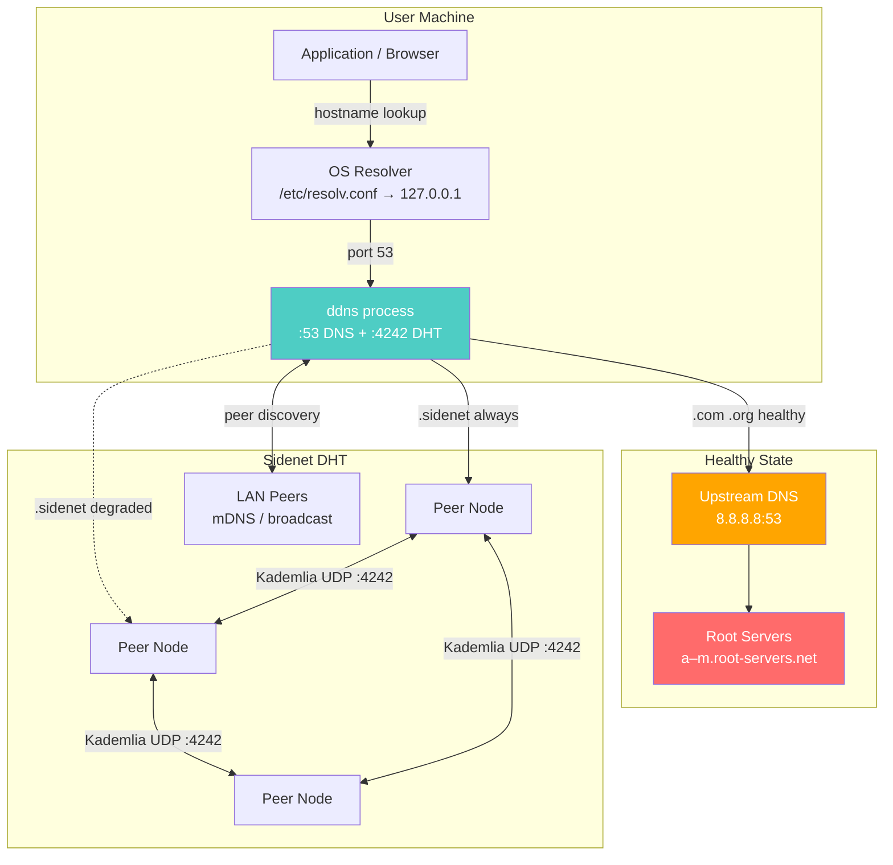
```mermaid
graph TB
    subgraph "User Machine"
        APP[Application / Browser]
        OS[OS Resolver<br>/etc/resolv.conf → 127.0.0.1]
        DDNS[ddns process<br>:53 DNS + :4242 DHT]
    end

    subgraph "Healthy State"
        UPSTREAM[Upstream DNS<br>8.8.8.8:53]
        ROOT[Root Servers<br>a–m.root-servers.net]
    end

    subgraph "Sidenet DHT"
        P1[Peer Node]
        P2[Peer Node]
        P3[Peer Node]
        LAN[LAN Peers<br>mDNS / broadcast]
    end

    APP -->|hostname lookup| OS
    OS -->|port 53| DDNS

    DDNS -->|.com .org healthy| UPSTREAM
    UPSTREAM --> ROOT

    DDNS -->|.sidenet always| P1
    DDNS -.->|.sidenet degraded| P2
    DDNS <-->|peer discovery| LAN

    P1 <-->|Kademlia UDP :4242| P2
    P2 <-->|Kademlia UDP :4242| P3
    P1 <-->|Kademlia UDP :4242| P3

    style ROOT fill:#ff6b6b,color:#fff
    style UPSTREAM fill:#ffa500,color:#fff
    style DDNS fill:#4ecdc4,color:#fff
```

**Key insight**: The system adds a transparent proxy layer at the OS DNS level. In normal operation it is invisible — it simply forwards queries upstream. When it detects root server failure, it switches to DHT resolution for `.sidenet` names with no user intervention.

---

## 2. Component Architecture

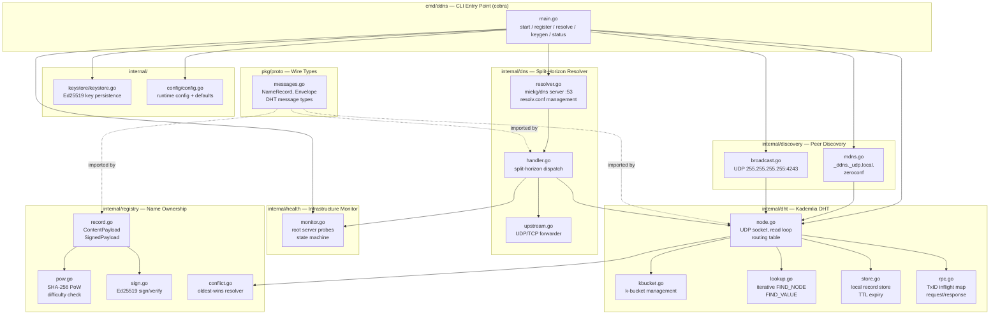
```mermaid
graph TB
    subgraph cmd["cmd/ddns — CLI Entry Point (cobra)"]
        MAIN[main.go<br>start / register / resolve / keygen / status]
    end

    subgraph dns_pkg["internal/dns — Split-Horizon Resolver"]
        RESOLVER[resolver.go<br>miekg/dns server :53<br>resolv.conf management]
        HANDLER[handler.go<br>split-horizon dispatch]
        UPSTREAM_FWD[upstream.go<br>UDP/TCP forwarder]
    end

    subgraph health_pkg["internal/health — Infrastructure Monitor"]
        MONITOR[monitor.go<br>root server probes<br>state machine]
    end

    subgraph dht_pkg["internal/dht — Kademlia DHT"]
        NODE[node.go<br>UDP socket, read loop<br>routing table]
        KBUCKET[kbucket.go<br>k-bucket management]
        LOOKUP[lookup.go<br>iterative FIND_NODE<br>FIND_VALUE]
        STORE[store.go<br>local record store<br>TTL expiry]
        RPC[rpc.go<br>TxID inflight map<br>request/response]
    end

    subgraph registry_pkg["internal/registry — Name Ownership"]
        RECORD[record.go<br>ContentPayload<br>SignedPayload]
        POW[pow.go<br>SHA-256 PoW<br>difficulty check]
        SIGN[sign.go<br>Ed25519 sign/verify]
        CONFLICT[conflict.go<br>oldest-wins resolver]
    end

    subgraph discovery_pkg["internal/discovery — Peer Discovery"]
        MDNS[mdns.go<br>_ddns._udp.local.<br>zeroconf]
        BCAST[broadcast.go<br>UDP 255.255.255.255:4243]
    end

    subgraph support["internal/"]
        KEYSTORE[keystore/keystore.go<br>Ed25519 key persistence]
        CONFIG[config/config.go<br>runtime config + defaults]
    end

    subgraph proto_pkg["pkg/proto — Wire Types"]
        PROTO[messages.go<br>NameRecord, Envelope<br>DHT message types]
    end

    MAIN --> RESOLVER
    MAIN --> NODE
    MAIN --> MONITOR
    MAIN --> MDNS
    MAIN --> BCAST
    MAIN --> KEYSTORE
    MAIN --> CONFIG

    RESOLVER --> HANDLER
    HANDLER --> UPSTREAM_FWD
    HANDLER --> NODE
    HANDLER --> MONITOR

    NODE --> KBUCKET
    NODE --> LOOKUP
    NODE --> STORE
    NODE --> RPC
    NODE --> CONFLICT

    RECORD --> POW
    RECORD --> SIGN

    MDNS --> NODE
    BCAST --> NODE

    PROTO -.->|imported by| NODE
    PROTO -.->|imported by| HANDLER
    PROTO -.->|imported by| RECORD
```

---

## 3. Network Creation & Bootstrap

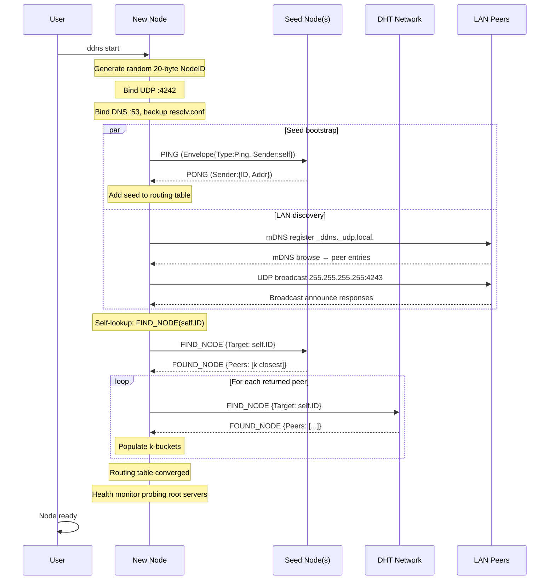
```mermaid
sequenceDiagram
    participant U as User
    participant N as New Node
    participant S as Seed Node(s)
    participant DHT as DHT Network
    participant LAN as LAN Peers

    U->>N: ddns start

    Note over N: Generate random 20-byte NodeID
    Note over N: Bind UDP :4242
    Note over N: Bind DNS :53, backup resolv.conf

    par Seed bootstrap
        N->>S: PING (Envelope{Type:Ping, Sender:self})
        S-->>N: PONG (Sender:{ID, Addr})
        Note over N: Add seed to routing table
    and LAN discovery
        N->>LAN: mDNS register _ddns._udp.local.
        LAN-->>N: mDNS browse → peer entries
        N->>LAN: UDP broadcast 255.255.255.255:4243
        LAN-->>N: Broadcast announce responses
    end

    Note over N: Self-lookup: FIND_NODE(self.ID)
    N->>S: FIND_NODE {Target: self.ID}
    S-->>N: FOUND_NODE {Peers: [k closest]}
    loop For each returned peer
        N->>DHT: FIND_NODE {Target: self.ID}
        DHT-->>N: FOUND_NODE {Peers: [...]}
        Note over N: Populate k-buckets
    end

    Note over N: Routing table converged
    Note over N: Health monitor probing root servers
    U->>U: Node ready
```

### Bootstrap Fallback Chain

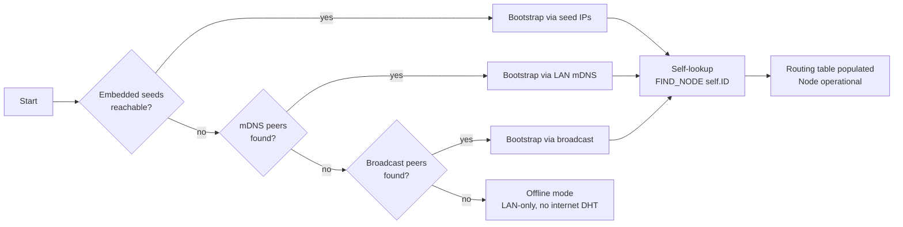
```mermaid
flowchart LR
    A[Start] --> B{Embedded seeds\nreachable?}
    B -->|yes| C[Bootstrap via seed IPs]
    B -->|no| D{mDNS peers\nfound?}
    D -->|yes| E[Bootstrap via LAN mDNS]
    D -->|no| F{Broadcast peers\nfound?}
    F -->|yes| G[Bootstrap via broadcast]
    F -->|no| H[Offline mode\nLAN-only, no internet DHT]

    C --> I[Self-lookup\nFIND_NODE self.ID]
    E --> I
    G --> I
    I --> J[Routing table populated\nNode operational]
```

---

## 4. DNS Resolution Flow

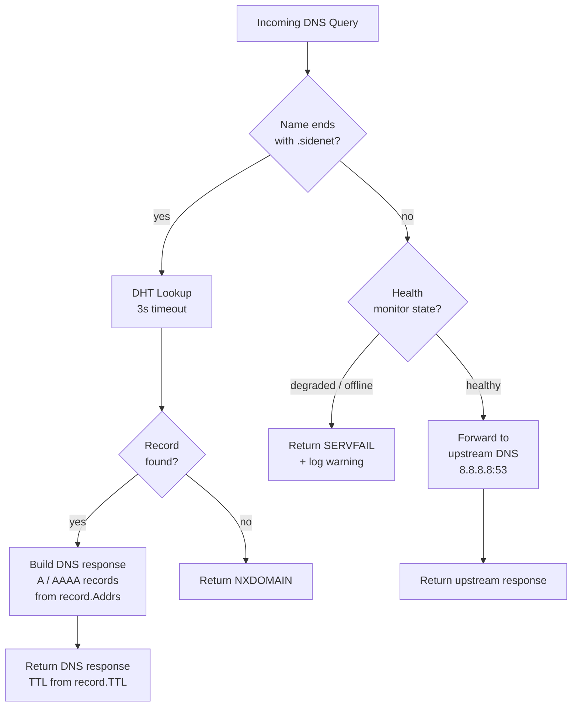
```mermaid
flowchart TD
    Q[Incoming DNS Query] --> CHECK{Name ends\nwith .sidenet?}

    CHECK -->|yes| DHT_LOOKUP[DHT Lookup\n3s timeout]
    CHECK -->|no| HEALTH{Health\nmonitor state?}

    HEALTH -->|healthy| UPSTREAM[Forward to\nupstream DNS\n8.8.8.8:53]
    HEALTH -->|degraded / offline| SERVFAIL[Return SERVFAIL\n+ log warning]

    DHT_LOOKUP --> FOUND{Record\nfound?}
    FOUND -->|yes| BUILD[Build DNS response\nA / AAAA records\nfrom record.Addrs]
    FOUND -->|no| NXDOMAIN[Return NXDOMAIN]

    UPSTREAM --> RESP_UP[Return upstream response]
    BUILD --> RESP_DHT[Return DNS response\nTTL from record.TTL]
```

### Split-Horizon Detail

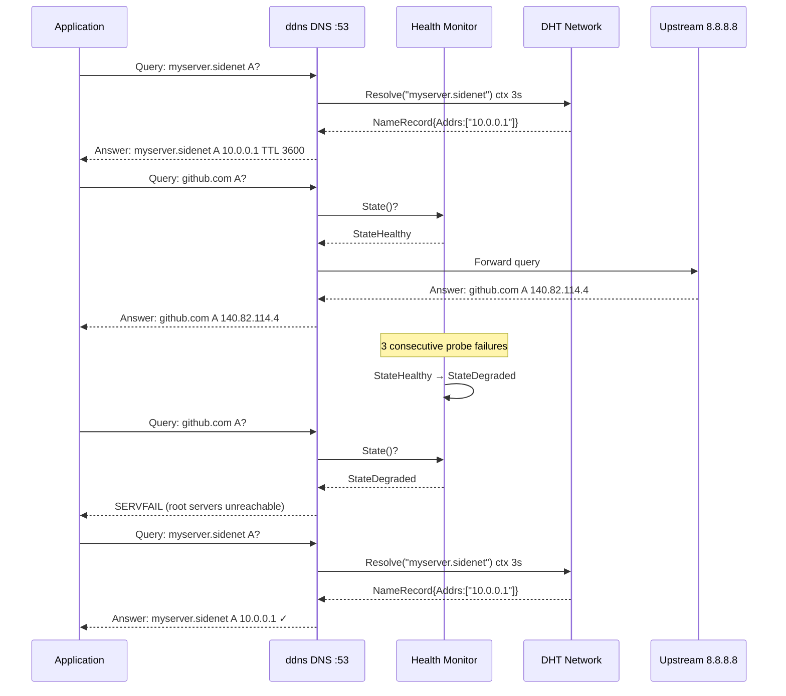
```mermaid
sequenceDiagram
    participant APP as Application
    participant DNS as ddns DNS :53
    participant MON as Health Monitor
    participant DHT as DHT Network
    participant UP as Upstream 8.8.8.8

    APP->>DNS: Query: myserver.sidenet A?
    DNS->>DHT: Resolve("myserver.sidenet") ctx 3s
    DHT-->>DNS: NameRecord{Addrs:["10.0.0.1"]}
    DNS-->>APP: Answer: myserver.sidenet A 10.0.0.1 TTL 3600

    APP->>DNS: Query: github.com A?
    DNS->>MON: State()?
    MON-->>DNS: StateHealthy
    DNS->>UP: Forward query
    UP-->>DNS: Answer: github.com A 140.82.114.4
    DNS-->>APP: Answer: github.com A 140.82.114.4

    Note over MON: 3 consecutive probe failures
    MON->>MON: StateHealthy → StateDegraded

    APP->>DNS: Query: github.com A?
    DNS->>MON: State()?
    MON-->>DNS: StateDegraded
    DNS-->>APP: SERVFAIL (root servers unreachable)

    APP->>DNS: Query: myserver.sidenet A?
    DNS->>DHT: Resolve("myserver.sidenet") ctx 3s
    DHT-->>DNS: NameRecord{Addrs:["10.0.0.1"]}
    DNS-->>APP: Answer: myserver.sidenet A 10.0.0.1 ✓
```

---

## 5. Name Registration Flow

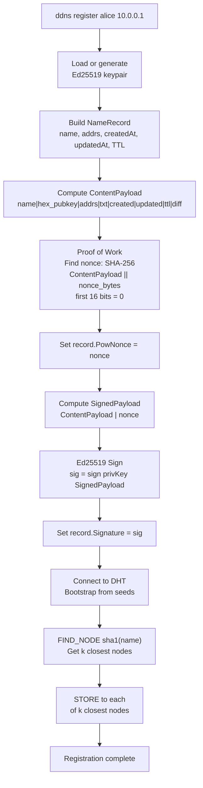
```mermaid
flowchart TD
    A[ddns register alice 10.0.0.1] --> B[Load or generate\nEd25519 keypair]
    B --> C[Build NameRecord\nname, addrs, createdAt, updatedAt, TTL]
    C --> D["Compute ContentPayload\nname#124;hex_pubkey#124;addrs#124;txt#124;created#124;updated#124;ttl#124;diff"]
    D --> E["Proof of Work\nFind nonce: SHA-256\nContentPayload #124;#124; nonce_bytes\nfirst 16 bits = 0"]
    E --> F[Set record.PowNonce = nonce]
    F --> G["Compute SignedPayload\nContentPayload #124; nonce"]
    G --> H["Ed25519 Sign\nsig = sign privKey SignedPayload"]
    H --> I[Set record.Signature = sig]
    I --> J[Connect to DHT\nBootstrap from seeds]
    J --> K["FIND_NODE sha1(name)\nGet k closest nodes"]
    K --> L[STORE to each\nof k closest nodes]
    L --> M[Registration complete]
```

### PoW + Signature Payload Design

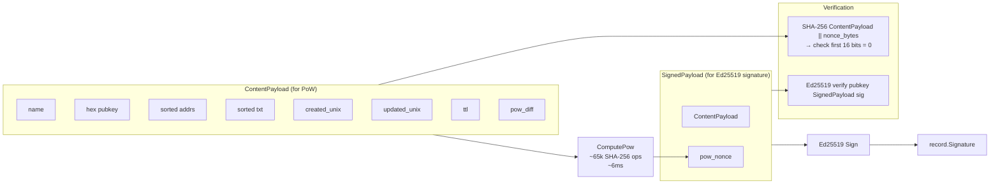
```mermaid
graph LR
    subgraph ContentPayload["ContentPayload (for PoW)"]
        F1[name]
        F2[hex pubkey]
        F3[sorted addrs]
        F4[sorted txt]
        F5[created_unix]
        F6[updated_unix]
        F7[ttl]
        F8[pow_diff]
    end

    subgraph SignedPayload["SignedPayload (for Ed25519 signature)"]
        CP[ContentPayload]
        F9[pow_nonce]
    end

    subgraph Verification
        V1["SHA-256 ContentPayload #124;#124; nonce_bytes\n→ check first 16 bits = 0"]
        V2[Ed25519 verify pubkey SignedPayload sig]
    end

    ContentPayload --> POW[ComputePow\n~65k SHA-256 ops\n~6ms]
    POW --> F9
    SignedPayload --> SIGN[Ed25519 Sign]
    SIGN --> SIG[record.Signature]

    ContentPayload --> V1
    SignedPayload --> V2
```

---

## 6. Kademlia DHT — Low-Level Design

### Routing Table Layout

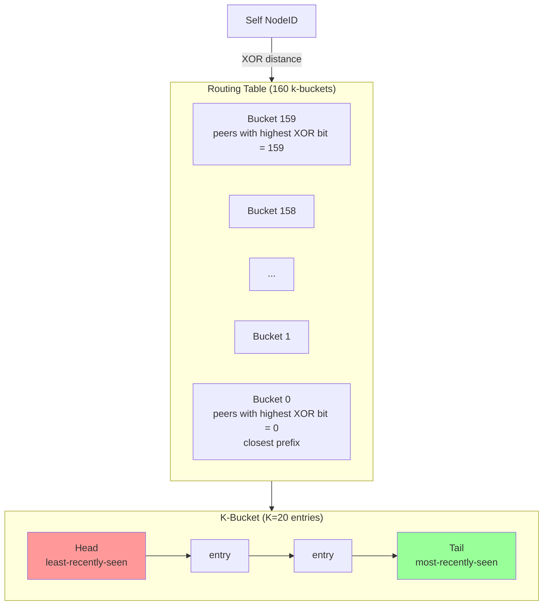
```mermaid
graph TD
    subgraph RoutingTable["Routing Table (160 k-buckets)"]
        B159[Bucket 159\npeers with highest XOR bit = 159]
        B158[Bucket 158]
        BDOT[...]
        B1[Bucket 1]
        B0[Bucket 0\npeers with highest XOR bit = 0\nclosest prefix]
    end

    subgraph KBucket["K-Bucket (K=20 entries)"]
        direction LR
        HEAD[Head\nleast-recently-seen]
        E1[entry]
        E2[entry]
        TAIL[Tail\nmost-recently-seen]
        HEAD --> E1 --> E2 --> TAIL
    end

    SELF[Self NodeID] -->|XOR distance| RoutingTable
    RoutingTable --> KBucket

    style HEAD fill:#ff9999
    style TAIL fill:#99ff99
```

### K-Bucket Insert Policy

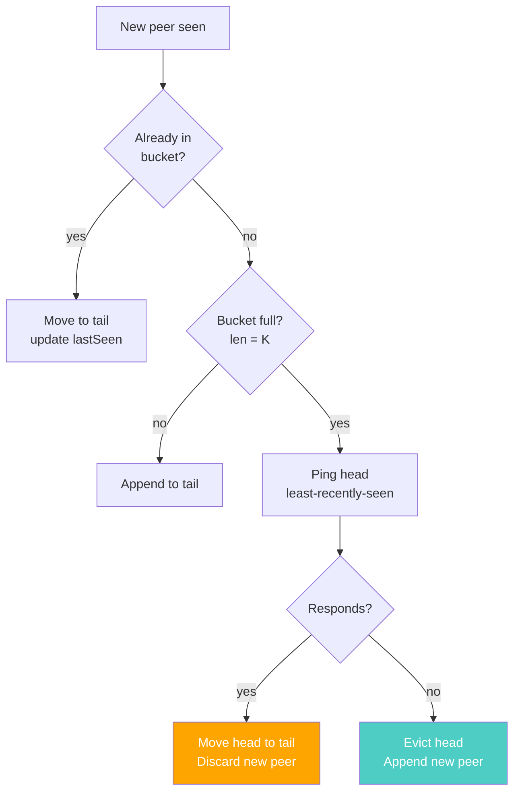
```mermaid
flowchart TD
    NEW[New peer seen] --> EXISTS{Already in\nbucket?}
    EXISTS -->|yes| REFRESH[Move to tail\nupdate lastSeen]
    EXISTS -->|no| FULL{Bucket full?\nlen = K}
    FULL -->|no| APPEND[Append to tail]
    FULL -->|yes| PING_HEAD[Ping head\nleast-recently-seen]
    PING_HEAD --> ALIVE{Responds?}
    ALIVE -->|yes| MOVE[Move head to tail\nDiscard new peer]
    ALIVE -->|no| EVICT[Evict head\nAppend new peer]

    style EVICT fill:#4ecdc4,color:#fff
    style MOVE fill:#ffa500,color:#fff
```

> **Why prefer old nodes?** Nodes that have been up a long time are statistically more likely to stay up. This makes the routing table resistant to churn-poisoning attacks where an attacker floods the network with new nodes to flush routing tables.

### Iterative Lookup Algorithm

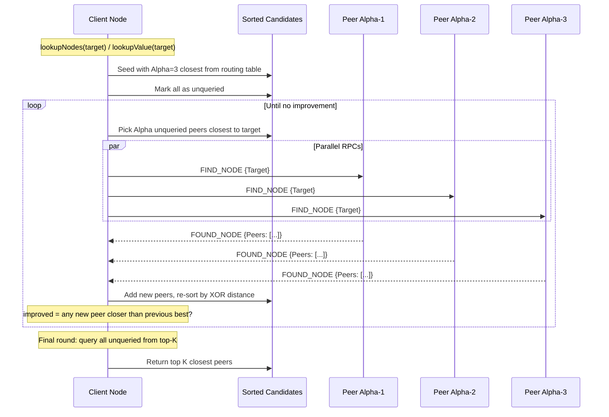
```mermaid
sequenceDiagram
    participant C as Client Node
    participant S as Sorted Candidates
    participant P1 as Peer Alpha-1
    participant P2 as Peer Alpha-2
    participant P3 as Peer Alpha-3

    Note over C: lookupNodes(target) / lookupValue(target)
    C->>S: Seed with Alpha=3 closest from routing table
    C->>S: Mark all as unqueried

    loop Until no improvement
        C->>S: Pick Alpha unqueried peers closest to target
        par Parallel RPCs
            C->>P1: FIND_NODE {Target}
            C->>P2: FIND_NODE {Target}
            C->>P3: FIND_NODE {Target}
        end
        P1-->>C: FOUND_NODE {Peers: [...]}
        P2-->>C: FOUND_NODE {Peers: [...]}
        P3-->>C: FOUND_NODE {Peers: [...]}
        C->>S: Add new peers, re-sort by XOR distance
        Note over C: improved = any new peer closer than previous best?
    end

    Note over C: Final round: query all unqueried from top-K
    C->>S: Return top K closest peers
```

### RPC Inflight Map

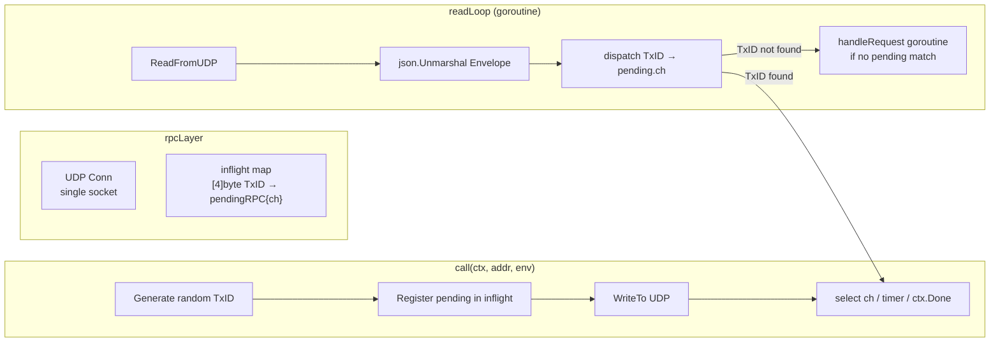
```mermaid
graph LR
    subgraph rpcLayer["rpcLayer"]
        CONN[UDP Conn\nsingle socket]
        INFLIGHT["inflight map\n[4]byte TxID → pendingRPC{ch}"]
    end

    subgraph call["call(ctx, addr, env)"]
        TXID[Generate random TxID]
        REGISTER[Register pending in inflight]
        SEND[WriteTo UDP]
        WAIT[select ch / timer / ctx.Done]
    end

    subgraph readLoop["readLoop (goroutine)"]
        READ[ReadFromUDP]
        UNMARSHAL[json.Unmarshal Envelope]
        DISPATCH[dispatch TxID → pending.ch]
        HANDLE[handleRequest goroutine\nif no pending match]
    end

    TXID --> REGISTER --> SEND --> WAIT
    READ --> UNMARSHAL --> DISPATCH
    DISPATCH -->|TxID found| WAIT
    DISPATCH -->|TxID not found| HANDLE
```

---

## 7. Health Monitor State Machine

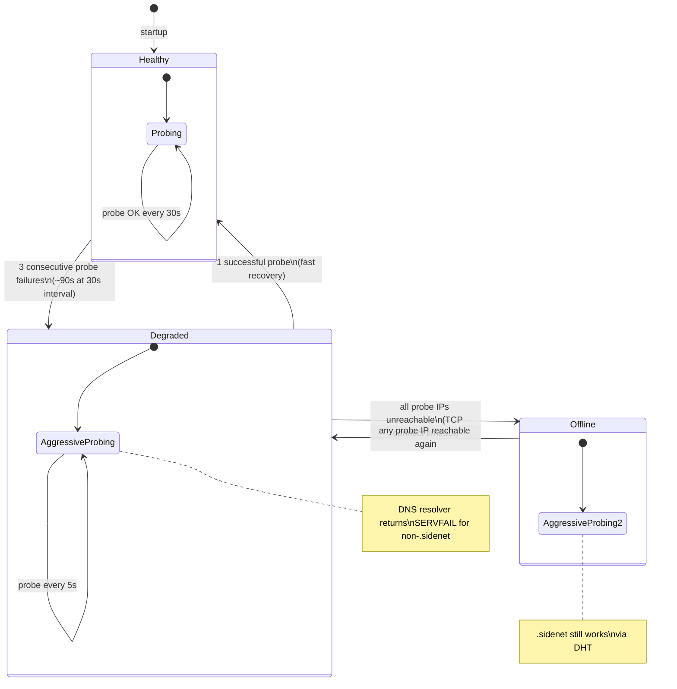
```mermaid
stateDiagram-v2
    [*] --> Healthy: startup

    Healthy --> Degraded: 3 consecutive probe failures\n(~90s at 30s interval)
    Degraded --> Healthy: 1 successful probe\n(fast recovery)
    Degraded --> Offline: all probe IPs unreachable\n(TCP connect timeout)
    Offline --> Degraded: any probe IP reachable again

    state Healthy {
        [*] --> Probing
        Probing --> Probing: probe OK every 30s
    }

    state Degraded {
        [*] --> AggressiveProbing
        AggressiveProbing --> AggressiveProbing: probe every 5s
        note right of AggressiveProbing: DNS resolver returns\nSERVFAIL for non-.sidenet
    }

    state Offline {
        [*] --> AggressiveProbing2
        note right of AggressiveProbing2: .sidenet still works\nvia DHT
    }
```

### Probe Mechanism

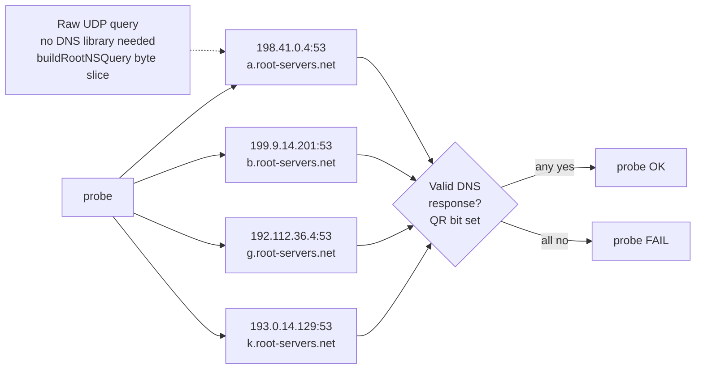
```mermaid
flowchart LR
    PROBE[probe] --> A[198.41.0.4:53\na.root-servers.net]
    PROBE --> B[199.9.14.201:53\nb.root-servers.net]
    PROBE --> C[192.112.36.4:53\ng.root-servers.net]
    PROBE --> D[193.0.14.129:53\nk.root-servers.net]

    A --> CHECK{Valid DNS\nresponse?\nQR bit set}
    B --> CHECK
    C --> CHECK
    D --> CHECK

    CHECK -->|any yes| OK[probe OK]
    CHECK -->|all no| FAIL[probe FAIL]

    NOTE[Raw UDP query\nno DNS library needed\nbuildRootNSQuery byte slice]
    NOTE -.-> A
```

---

## 8. Conflict Resolution & Partition Merge

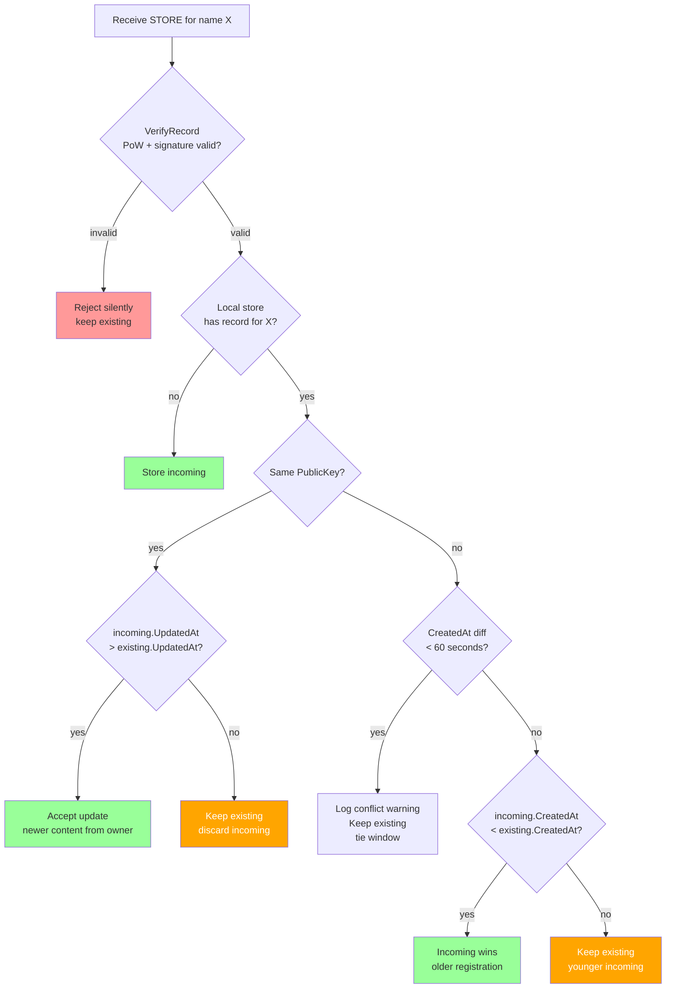
```mermaid
flowchart TD
    RECV[Receive STORE for name X] --> VERIFY{VerifyRecord\nPoW + signature valid?}
    VERIFY -->|invalid| REJECT[Reject silently\nkeep existing]
    VERIFY -->|valid| HAS{Local store\nhas record for X?}
    HAS -->|no| ACCEPT[Store incoming]
    HAS -->|yes| SAME_OWNER{Same PublicKey?}

    SAME_OWNER -->|yes| NEWER{incoming.UpdatedAt\n> existing.UpdatedAt?}
    NEWER -->|yes| UPDATE[Accept update\nnewer content from owner]
    NEWER -->|no| KEEP[Keep existing\ndiscard incoming]

    SAME_OWNER -->|no| TIE{CreatedAt diff\n< 60 seconds?}
    TIE -->|yes| WARN[Log conflict warning\nKeep existing\ntie window]
    TIE -->|no| OLDEST{incoming.CreatedAt\n< existing.CreatedAt?}
    OLDEST -->|yes| WIN[Incoming wins\nolder registration]
    OLDEST -->|no| KEEP2[Keep existing\nyounger incoming]

    style ACCEPT fill:#99ff99
    style UPDATE fill:#99ff99
    style WIN fill:#99ff99
    style REJECT fill:#ff9999
    style KEEP fill:#ffa500,color:#fff
    style KEEP2 fill:#ffa500,color:#fff
```

### Partition Scenario

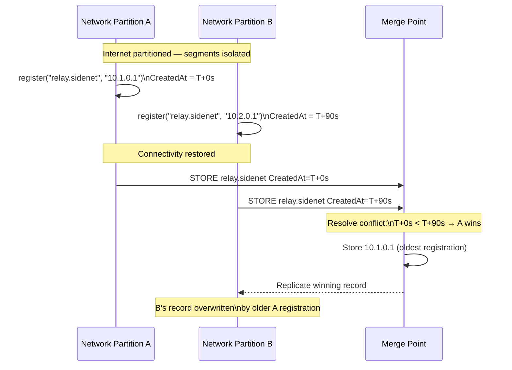
```mermaid
sequenceDiagram
    participant A as Network Partition A
    participant B as Network Partition B
    participant M as Merge Point

    Note over A,B: Internet partitioned — segments isolated

    A->>A: register("relay.sidenet", "10.1.0.1")\nCreatedAt = T+0s
    B->>B: register("relay.sidenet", "10.2.0.1")\nCreatedAt = T+90s

    Note over A,B: Connectivity restored

    A->>M: STORE relay.sidenet CreatedAt=T+0s
    B->>M: STORE relay.sidenet CreatedAt=T+90s

    Note over M: Resolve conflict:\nT+0s < T+90s → A wins
    M->>M: Store 10.1.0.1 (oldest registration)
    M-->>B: Replicate winning record

    Note over B: B's record overwritten\nby older A registration
```

---

## 9. LAN Discovery Pipeline

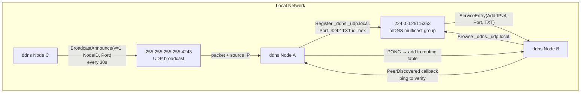
```mermaid
graph TD
    subgraph LAN["Local Network"]
        N1[ddns Node A]
        N2[ddns Node B]
        N3[ddns Node C]
        MDNS_GROUP[224.0.0.251:5353\nmDNS multicast group]
        BCAST_ADDR[255.255.255.255:4243\nUDP broadcast]
    end

    N1 -->|"Register _ddns._udp.local.\nPort=4242 TXT id=hex"| MDNS_GROUP
    N2 -->|Browse _ddns._udp.local.| MDNS_GROUP
    MDNS_GROUP -->|"ServiceEntry(AddrIPv4, Port, TXT)"| N2

    N3 -->|"BroadcastAnnounce(v=1, NodeID, Port)\nevery 30s"| BCAST_ADDR
    BCAST_ADDR -->|packet + source IP| N1

    N2 -->|PeerDiscovered callback\nping to verify| N1
    N1 -->|PONG → add to routing table| N2
```

### Discovery Event Flow

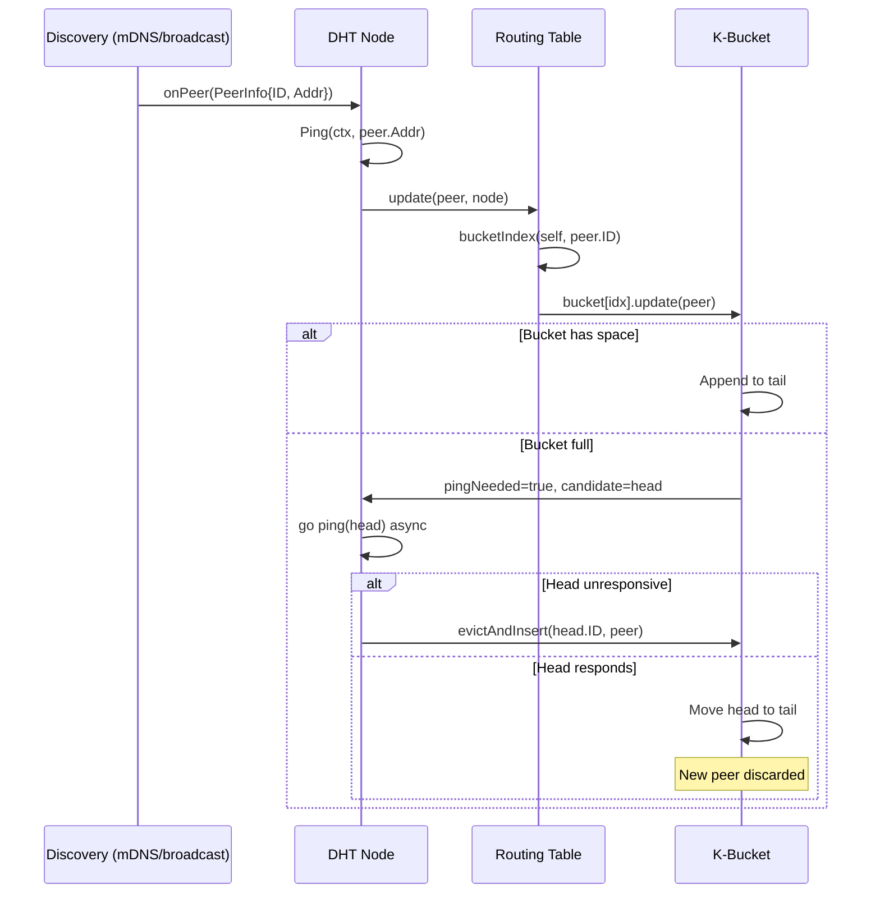
```mermaid
sequenceDiagram
    participant D as Discovery (mDNS/broadcast)
    participant N as DHT Node
    participant RT as Routing Table
    participant B as K-Bucket

    D->>N: onPeer(PeerInfo{ID, Addr})
    N->>N: Ping(ctx, peer.Addr)
    N->>RT: update(peer, node)
    RT->>RT: bucketIndex(self, peer.ID)
    RT->>B: bucket[idx].update(peer)
    alt Bucket has space
        B->>B: Append to tail
    else Bucket full
        B->>N: pingNeeded=true, candidate=head
        N->>N: go ping(head) async
        alt Head unresponsive
            N->>B: evictAndInsert(head.ID, peer)
        else Head responds
            B->>B: Move head to tail
            Note over B: New peer discarded
        end
    end
```

---

## 10. Data Structures

### NameRecord

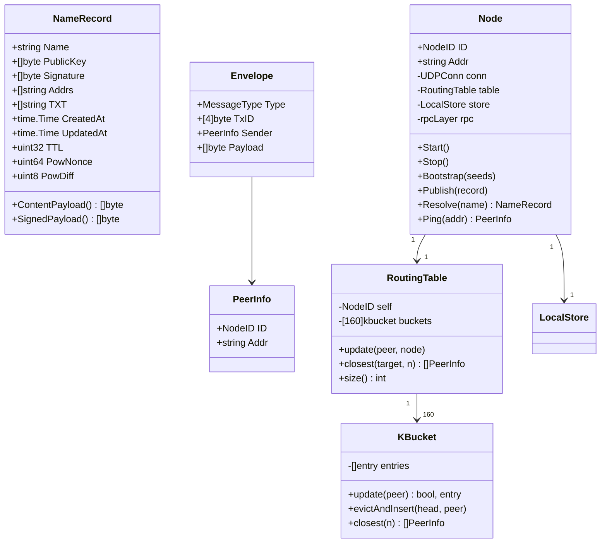
```mermaid
classDiagram
    class NameRecord {
        +string Name
        +[]byte PublicKey
        +[]byte Signature
        +[]string Addrs
        +[]string TXT
        +time.Time CreatedAt
        +time.Time UpdatedAt
        +uint32 TTL
        +uint64 PowNonce
        +uint8 PowDiff
        +ContentPayload() []byte
        +SignedPayload() []byte
    }

    class Envelope {
        +MessageType Type
        +[4]byte TxID
        +PeerInfo Sender
        +[]byte Payload
    }

    class PeerInfo {
        +NodeID ID
        +string Addr
    }

    class Node {
        +NodeID ID
        +string Addr
        -UDPConn conn
        -RoutingTable table
        -LocalStore store
        -rpcLayer rpc
        +Start()
        +Stop()
        +Bootstrap(seeds)
        +Publish(record)
        +Resolve(name) NameRecord
        +Ping(addr) PeerInfo
    }

    class RoutingTable {
        -NodeID self
        -[160]kbucket buckets
        +update(peer, node)
        +closest(target, n) []PeerInfo
        +size() int
    }

    class KBucket {
        -[]entry entries
        +update(peer) bool, entry
        +evictAndInsert(head, peer)
        +closest(n) []PeerInfo
    }

    Node "1" --> "1" RoutingTable
    Node "1" --> "1" LocalStore
    RoutingTable "1" --> "160" KBucket
    Envelope --> PeerInfo
```

### DHT Message Flow

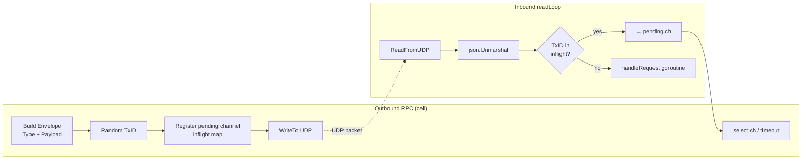
```mermaid
graph LR
    subgraph Outbound["Outbound RPC (call)"]
        REQ[Build Envelope\nType + Payload]
        TXID_GEN[Random TxID]
        REGISTER_CH[Register pending channel\ninflight map]
        WRITE[WriteTo UDP]
        SELECT[select ch / timeout]
    end

    subgraph Inbound["Inbound readLoop"]
        READ2[ReadFromUDP]
        UNMARSHAL2[json.Unmarshal]
        MATCH{TxID in\ninflight?}
        DISPATCH2[→ pending.ch]
        GOROUTINE[handleRequest goroutine]
    end

    REQ --> TXID_GEN --> REGISTER_CH --> WRITE
    WRITE -.->|UDP packet| READ2
    READ2 --> UNMARSHAL2 --> MATCH
    MATCH -->|yes| DISPATCH2 --> SELECT
    MATCH -->|no| GOROUTINE
```

---

## 11. Security Model

```mermaid
graph TD
    subgraph OwnershipChain["Name Ownership Chain"]
        KEY[Ed25519 keypair\ngenerated locally]
        PUB[PublicKey in record]
        SIG[Signature covers\nContentPayload + PowNonce]
        POW_NONCE[PowNonce\nSHA-256 difficulty 16]
        CONTENT[ContentPayload\nname + pubkey + addrs\n+ timestamps + ttl + diff]
    end

    subgraph Verification["Verification at every STORE"]
        V1[Check len pubkey = 32]
        V2[Check len sig = 64]
        V3[Recompute ContentPayload]
        V4[SHA-256 ContentPayload‖nonce\ncheck bits 0..15 = 0]
        V5[Recompute SignedPayload]
        V6[Ed25519 verify\npubkey SignedPayload sig]
        V7[accept / reject]
    end

    KEY --> PUB
    KEY --> SIG
    CONTENT --> POW_NONCE
    CONTENT --> SIG
    POW_NONCE --> SIG

    V1 --> V2 --> V3 --> V4 --> V5 --> V6 --> V7

    subgraph Attacks["Attack Resistance"]
        A1[Sybil: bulk registration\n→ 65k SHA-256 ops per name\ncost: ~6ms CPU per name]
        A2[Name squatting across partition\n→ oldest CreatedAt wins\nimmutable + signed]
        A3[Record tampering\n→ ed25519 signature\ncovers all fields]
        A4[Routing table poisoning\n→ prefer old nodes policy\nevict unresponsive only]
    end

    style A1 fill:#4ecdc4,color:#fff
    style A2 fill:#4ecdc4,color:#fff
    style A3 fill:#4ecdc4,color:#fff
    style A4 fill:#4ecdc4,color:#fff
```

---

## Design Patterns

| Pattern | Where Used | Why |
|---|---|---|
| **Split-horizon proxy** | `dns/handler.go` | Transparent to apps — same interface, different backends |
| **TxID inflight map** | `dht/rpc.go` | Request/response multiplexing over a single UDP socket |
| **Observer / pub-sub** | `health/monitor.go` → subscribers | Decouple health detection from DNS handler reaction |
| **Prefer-old eviction** | `dht/kbucket.go` | Kademlia routing stability under churn |
| **Iterative lookup** | `dht/lookup.go` | Tolerant to partial failures — no single node is critical |
| **Canonical payload** | `registry/record.go` | Deterministic signing regardless of serialization library |
| **Two-phase PoW+sign** | `registry/sign.go` | PoW on content (variable nonce), signature on final (with nonce) |
| **Oldest-wins CRDT** | `registry/conflict.go` | Partition-tolerant name ownership without consensus |
| **Crash recovery state file** | `dns/resolver.go` | Restores `/etc/resolv.conf` even after unclean shutdown |
| **Go:embed seeds** | `cmd/ddns/main.go` | Zero-config bootstrap — seeds compiled into binary |
